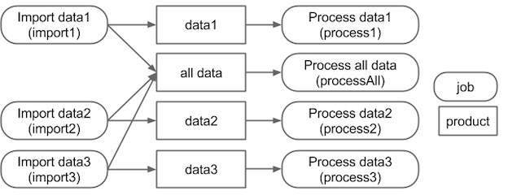

## Architecture

How jobs are executed with the patriot-workflow-scheduler is described
in the above figure.  The jobs are defined with Patriot Batch Config
(PBC) files in original DSL.  PBC files are parsed by the patriot
script and registered to JobStore.  The JobStore has a role of
determining which jobs are executable by managing dependency.  The
executable jobs are fetched by workers and executed by the workers.

## Model of jobs and dependency

The job dependency model is shown in the above figure.  The model is
designed on the basis of data flow.  The rounded rectangles and the
rectangles represent jobs and products, respectively.  The products
can be produced and/or required by one or more jobs.  The figure has
two kind of data (data1, data2) which are modeled as products.  The
product data1 and date2 are produced (required) by the job import1
(process1) and import2 (process2), respectively.  In addition, the
figure has a virtual product ('all data') which is produced by the
import1 and the import2 and required by the processAll.  A job is
judged as executable when all products the job requires are available.
A product becomes available when all jobs which produce the product
are successfully finished.

For instance, the process1 becomes executable when the import1 is
finished because the process1 only requires the data1 and it is
produced only by the import1.  On the other hand, both the import1 and
the import2 have to be finished for the processAll.  The processAll
only requires the 'data all' but it has two producers (import1 and
import2).

The data flow based dependency model can improve modularity of
dependency configuration.  Consider a situation that new data (data3)
which should be processed as all data is added which should be
processed as all data for instance.  The below figure shows this kind
of extension can be achieved by only producer-side modification due to
the existence of the virtual product ('all data').  By setting the
'all data' as a product of the import3, the processAll requires
completion of the import3 to become executable.  The patriot workflow
scheduler provides [an original Patriot Batch Config DSL
(PBC)](pbc.html) to describe the data-flow based dependency model.

