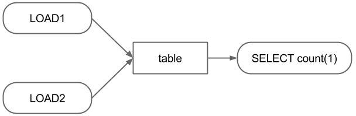

============================
Job Configuration DSL (PBC)
============================

PBC is a ruby-based DSL to describe batch jobs with dependency.
Jobs in this workflow scheduler can be defined in a set of key value
pairs with a job type (called command).
PBC enables us to write common key values in one space and simplifies
batch configurations.
In addition, the DSL are designed to be extensible, so that new commands can be incorporated.

The below is a 'Hello World' example.

.. code-block:: ruby

  % cat test.pbc
  sh{
    name 'test'
    commands ["echo 'hello world' > /tmp/out.txt"]
  }

::

  % ./bin/patriot execute 2015-04-01 test.pbc
  % cat /tmp/out.txt
  hello world

The initial target of this scheduler is daily batch jobs and the script takes a date (or range of dates) as an argument.
The date given as the argument can be used via the variable '_date_'.
For instance,

.. code-block:: ruby

  % cat test.pbc
  sh{
    name 'test'
    commands ["echo 'hello world (#{_date_})' > /tmp/out.txt"]
  }
  % ./bin/patriot execute 2015-04-01 test.pbc
  % cat /tmp/out.txt
  hello world (2015-04-01)

Configuring Dependency
========================

Consider above workflow as an example, in which the SELECT statement
should be executed after two LOAD statements.

This workflow can be defined in PBC as follows.

.. code-block:: ruby

  sh{
    produce ["table_#{_date_}"]
    name "load1_#{_date_}"
    commands ["hive -e 'LOAD DATA INPATH \'path_to_source1\' INTO TABLE table PARTITION (dt = \'#{_date_}\', type = \'1\')"]
  }

  sh{
    produce ["table_#{_date_}"]
    name "load2_#{_date_}"
    commands ["hive -e 'LOAD DATA INPATH \'path_to_source2\' INTO TABLE table PARTITION (dt = \'#{_date_}\', type = \'2\')"]
  }

  sh{
    require ["table_#{_date_}"]
    name "select_#{_date_}"
    commands ["hive -e 'SELECT count(1) FROM table WHERE dt = '#{_date_}' > result_#{_date_}"]
  }

Simplifying Configurations Using Job Groups
=============================================

In the above example, the two LOAD jobs have same product.
This can be consolidated by using job_group as follows.

.. code-block:: ruby

  job_group{
    produce ["table_#{_date_}"]
    sh{
      name "load1_#{_date_}"
      commands ["hive -e 'LOAD DATA INPATH \'path_to_source1\' INTO TABLE table PARTITION (dt = \'#{_date_}\', type = \'1\')"]
    }
    sh{
      name "load2_#{_date_}"
      commands ["hive -e 'LOAD DATA INPATH \'path_to_source2\' INTO TABLE table PARTITION (dt = \'#{_date_}\', type = \'2\')"]
    }
  }

  sh{
    require ["table_#{_date_}"]
    name "select_#{_date_}"
    commands ["hive -e 'SELECT count(1) FROM table WHERE dt = '#{_date_}' > result_#{_date_}"]
  }

Since PBC is an Ruby-internal DSL, this example can be written more concisely.

.. code-block:: ruby

  job_group{
    produce ["table_#{_date_}"]
    ["1", "2"].each do |i|
      sh{
        name "load#{i}_#{_date_}"
        commands ["hive -e 'LOAD DATA INPATH \'path_to_source#{i}\' INTO TABLE table PARTITION (dt = \'#{_date_}\', type = \'#{i}\')"]
      }
    end
  }

  sh{
    require ["table_#{_date_}"]
    name "select_#{_date_}"
    commands ["hive -e 'SELECT count(1) FROM table WHERE dt = \'#{_date_}\'' > result_#{_date_}"]
  }

Implementing and Using Custom Commands
=========================================

Until now, the every batch configurations need 'hive -e' and have
cumbersome quotes and escapes.
These issues can be removed by using custom command.

A custom command can be developed by implementing only 3 methods in a sub class of **Patriot::Command::Base** together with setting command name and its attributes.
The three methods are

* **job_id** which returns an identifier of the job in String.
* **description** which builds a string expressing what this job does.
* **execute** in which the process of the job is implemented

The command name is an expression used in the PBC and the attributes are used for implementing the above methods. The command name and the attributes can be set by using class macros, **declare\_command\_name** and **command_attr**, respectively.

Below is a custom command example which executes a Hive LOAD statement.

.. code-block:: ruby

  # written in hive_load_command.rb
  class HiveLoadCommand < Patriot::Command::Base
    # define command name
    declare_command_name :hive_load
    # set attributes of this command
    # the attributes can be available as instance variables
    command_attr :table, :partition, :source

    include Patriot::Util::System # utility for executes external scripts

    # create job_id of this job
    def job_id
      job_id = "#{command_name}_#{@table}" # command_name is defined in the super class
      return job_id if @partitions.nil?
      return "#{job_id}_#{partitions.map{|k,v| "#{k}_#{v}"}.join(",")}"
    end

    # return what this job do
    def description
      return build_load_statement
    end

    def execute
      cmd = "hive -e \"#{build_load_statement}\""
      execute_command(cmd)
    end

    def build_load_statement
      hql "LOAD DATA INPATH '#{@source}' INTO TABLE #{table}"
      return hql if @partitions.nil?
      return "#{hql} PARTITION (#{@partitions.map{|k,v| "#{k} = '#{v}'"}.join(", ")})"
    end

  end

Assuming the results of the SELECT statement needs to be stored other database (e.g. relational database or key-value store), a command for the such jobs could be like below.

.. code-block:: ruby

  # written in hive2db_command.rb
  class Hive2DBCommand < Patriot::Command::Base
    # define command name
    declare_command_name :hive2db
    # set attributes of this command
    # the attributes can be available as instance variables
    command_attr :name, :db, :table, :query

    include Patriot::Util::System # utility for executes external scripts

    # create job_id of this job
    def job_id
      return "#{command_name}_#{@name}_#{@db}_#{@table}"
    end

    # return what this job do
    def description
      return @query
    end

    def execute
      # execute_command return path to a file
      # in which the content of stdout is stored.
      so = execute_command(cmd)
      File.open(so) do |results|
        results.each do |result|
          # insert result to @db.@table
        end
      end
    end

  end

These command can be integrated by putting file in the plugins directory and set init.rb and patriot.ini to load the commands.

::

  mkdir -p ${INSTALL_DIR}/plugins/my_custom_commands/lib
  cp hive_load_command.rb ${INSTALL_DIR}/plugins/my_custom_commands/lib
  cp hive2db_command.rb ${INSTALL_DIR}/plugins/my_custom_commands/lib
  vi ${INSTALL_DIR}/plugins/my_custom_commands/init.rb
  cat ${INSTALL_DIR}/plugins/my_custom_commands/init.rb
  require 'patriot'
  require 'hive_load_command'
  require 'hive2db_command'

  vi ${INSTALL_DIR}/config/patriot.ini
  ...
  plugins=my_custom_commands,patriot-mysql2-client
  ...

By using the custom commands, the configurations can be written as below.

.. code-block:: ruby

  job_group{
    produce ["table_#{_date_}"]
    ["1", "2"].each do |i|
      hive_load{
        table 'table'
        partition 'dt' => _date_, 'type' => i
        source "path_to_source#{i}"
      }
    end
  }

  hive2db{
    require ["table_#{_date_}"]
    name "select_#{_date_}"
    db 'dbname'
    table 'tablename'
    query "SELECT count(1) FROM table WHERE dt = '#{_date_}'"
  }

Schedule Jobs
=============

Jobs can be scheduled like cron.
There are several ways to set scheduled jobs.

Cron Like Format
----------------

To set jobs to execute at 1 a.m. every day, write the following line anywhere in the pbc file.
The format is as same as cron format.

.. code-block:: ruby

  #interval 0 1 * * *

Other formats
----------------

To set jobs at the end of months, write the following line anywhere in the pbc files.

.. code-block:: ruby

  #interval end_of_every_month

To set jobs at specific date, add *exec_date* option to any command, job_group or composite_job.
The configuration can be written as below.

.. code-block:: ruby

  sh{
    name 'test'
    commands ["echo 'hello world' > /tmp/out.txt"]
    exec_date '2015-07-30'
  }

To set jobs at specific time, add *start_after* option to any command, job_group or composite_job.
The configuration can be written as below.

.. code-block:: ruby

  sh{
    name 'test'
    commands ["echo 'hello world' > /tmp/out.txt"]
    start_after '01:30:00'
  }

*exec_date* and *start_after* can be used together or separately.
If only *exec_date* is used, the execute time is set to 00:00:00.
And if only *start_after* is used, the execute date is set to the day after given target date.

Other Configuration Options
===========================

Priority
---------

Priority can be set by using *priority* in each job or job group.
Jobs in JobStore are sorted by the priority in ascending order.
Therefore, jobs with lower priority value are preferentially fetched.

.. code-block:: ruby

  sh{
    priority 0
    name 'high'
    commands ["echo 'higher priority'"]
  }
  sh{
    priority 10
    name 'low'
    commands ["echo 'lower priority'"]
  }

::

Skip / Suspend
----------------

Jobs can be skipped or suspended when they should not be executed automatically.
Each state can be set by putting *skip* or *suspend*, respectively

.. code-block:: ruby

  sh{
    skip
    name 'skip'
    commands ["echo 'skipped'"]
  }
  sh{
    suspend
    name 'suspend'
    commands ["echo 'suspended'"]
  }

::

Limiting Node/Host
----------------------

When a job should be run on a certain host, this can be achieved by setting *exec_host* or *exec_node*.
The *exec_host* limits the host where the job is executed (limited by hostname).
Jobs with *exec_node* are only executed by threads labeled with the configured labels (see :doc:`system configuration <config>`).

.. code-block:: ruby

  sh{
    exec_host 'hosts1'
    name 'host'
    commands ["echo 'executed on host1'"]
  }
  sh{
    exec_node 'node1'
    name 'node'
    commands ["echo 'execute by a thread labeled with node1'"]
  }

::

Retry
----------------------

Jobs can be configured to be retried in case of a failure.
In the retry configuration, retry interval and the number of retries can be configured.

.. code-block:: ruby

  sh{
    retrial 'count' => 3, 'interval' => 3600
    name 'retry'
    commands ["echo 'retry 3 time at intervals of 1 hour'"]
  }

::

Mail Notification
----------------------

To send a mail when a job finished, *mail_notification* should be set to the job.
For using this functionality, SMTP should be configured on the host where the worker process is running.

.. code-block:: ruby

  sh{
    mail_notification 'to' => test@test.com, 'on' => 'failed'
    name 'mail'
    commands ["echo 'notify failure'"]
  }
  sh{
    mail_notification 'to' => test@test.com, 'on' => 'succeeded'
    name 'mail'
    commands ["echo 'notify success'"]
  }

::
