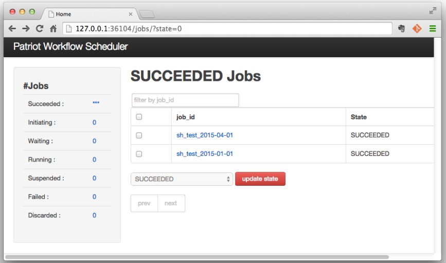

==============
Web Console
==============

Web console for managing jobs in JobStore is provided by worker processes at a port set by :doc:`'info_server_port' <config>` (default 36104).
The web console looks like below, and users can check and change states of jobs.

The number of jobs for each state can be shown at the left side pane and the main pane shows the list of jobs in a selected state.

Each job can be in one of following states.

* **Succeeded** : successfully finished (the number of jobs in this state is not counted since it tends to be large).
* **Initiating** : under registration process
* **Waiting** : waiting to be executed
* **Running** : some worker is executing
* **Suspended** : execution is suspended. jobs in this state are not fetched by workers.
* **Failed** : unsuccessfully finished
* **Discarded** : to be discarded. jobs in this state can be completely deleted with the web console.

.. note::

  * JobId Filter

      The web console has a capability for filtering jobs by job_id.
      The filter searches jobs by complete match.
      If you want to search jobs with job_ids prefixed with 'prefix', the filter should be set as 'prefix%'.

  * Discarded State

      The _discarded_ state is just a marker to confirm unnecessary jobs before complete deletion.
      If there exists jobs dependeing on discarded jobs, the jobs would not be executed.
      Jobs in the _discarded_ state should be deleted if the jobs are really unnecessary.

